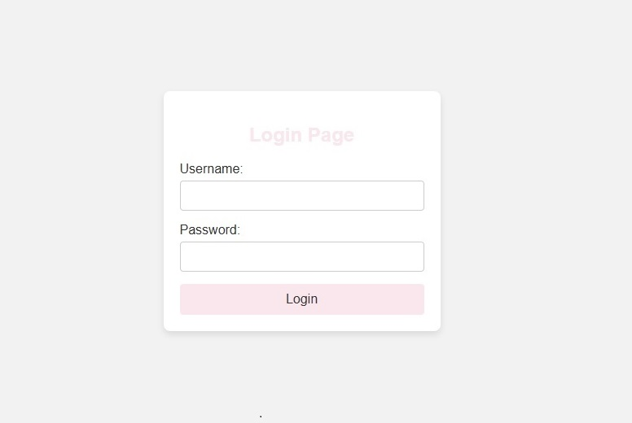
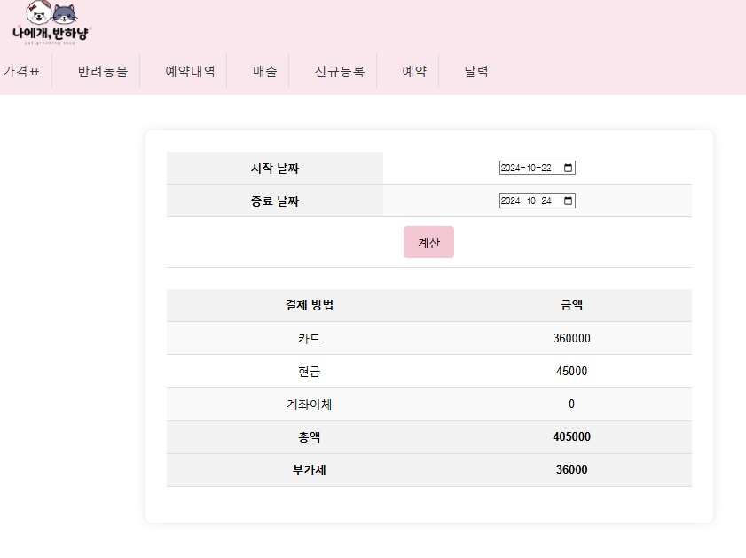

# 🐾 **애견미용 관리 시스템**  

### 📅 **프로젝트 개요**  
- **프로젝트명**: 애견미용 스케줄 및 고객 정보 관리 시스템  
- **수행 기간**: 2023년 10월 7일 ~ 진행 중  

### 🎯 **프로젝트 목표**  
- **스케줄 관리**: 애견미용 예약을 체계적으로 관리  
- **매출 관리**: 내역과 매출을 쉽게 파악할 수 있도록 개선  
- **고객 정보 관리**: 기존 고객의 정보를 효율적으로 검색 및 조회  

---

## ⚙️ **개발 환경 및 배포 인프라**  

### 🛠 **기술 스택**  
- **프레임워크**: Spring Boot (Thymeleaf 사용)  
- **언어**: Java  
- **데이터베이스**: Oracle Autonomous Transaction Processing (ATP)  
- **프론트엔드**: HTML, CSS, JavaScript, jQuery  
- **비동기 통신**: Ajax  
- **IDE**: IntelliJ IDEA  

### ☁️ **OCI(Oracle Cloud Infrastructure) 활용**  
1. **인스턴스 배포**  
   - Spring Boot 애플리케이션을 OCI 인스턴스에 배포  
2. **이미지 파일 저장**  
   - 고객 사진 등 이미지를 **OCI 버킷(Object Storage)**에 저장  
3. **데이터베이스 관리**  
   - **Oracle ATP**(Autonomous Transaction Processing)로 데이터 관리  
4. **클라우드 배포**  
   - 모든 애플리케이션과 데이터는 **OCI 인프라** 상에서 운영  

---

## 🔒 **보안 및 네트워킹 설정**  
- **개인정보 보호를 위한 접근 제어**  
  - 이 시스템의 데이터베이스에는 **고객의 개인정보**가 포함되어 있으므로 **공개 배포**가 불가능합니다.  
  - **Oracle ATP** 데이터베이스는 **네트워크 접근 제어**를 통해 관리되며, **허가된 IP 주소**에서만 접속이 허용됩니다.  
  - 외부에서 접근하려면 미리 설정된 **IP 화이트리스트**에 포함된 IP만 허용되므로, 권한을 가진 사용자만 시스템에 접근할 수 있습니다.  

---

## 📸 **실행 화면**

아래는 프로젝트의 주요 화면입니다. 각 번호에 맞는 이미지와 설명을 함께 제공합니다.

### 01. 로그인 필요 화면  
- 개인정보가 포함되어 있어 로그인 후에만 접근할 수 있습니다.  

  

---

### 02. 날짜별 미용 내역 확인  
- 달력에서 날짜를 클릭하면 **Ajax**를 통해 해당 날짜의 미용 내역을 표시합니다.  

  

---

### 03. 신규 반려동물 등록 화면  

  

---

### 04. 미용 내역 추가 화면  
- 반려동물 이름 입력 시 Ajax로 자동 검색하며, 최근 예약 내역 3개가 표시됩니다.  

  

---

### 05. 전체 일정 확인  
- 좌측 사이드바에서 달을 선택하여 일정 확인이 가능합니다.  

  

---

### 06. 미용 내역 수정 및 삭제  
- 미용 내역을 클릭하면 즉시 수정과 삭제가 가능합니다.  

  

---

### 07. 반려동물 목록  
- 우측 검색창에서 번호 또는 이름으로 반려동물을 검색할 수 있습니다.  

  

---

### 08. 반려동물 상세 내역  
- 사진이 없을 경우 기본 이미지가 표시되며, 등록할 수 있는 버튼이 나타납니다.  

  

---

#### 08_01. 등록된 사진이 있을 경우  
- 중앙에 사진이 표시되며, 여러 장의 사진은 슬라이드 형태로 확인할 수 있습니다.  

  

---

#### 08_02. 작은 사진 클릭 시 원본 이미지 보기  
- 예약 내역의 작은 사진을 클릭하면 원본 크기로 볼 수 있는 **모달**이 표시됩니다.  

  

---

#### 08_03. 노쇼 및 당일 취소 처리  
- 노쇼와 당일 취소 기록을 추가 및 삭제할 수 있습니다.  

  

---

#### 08_04. 메모 수정  
- 메모는 바로 수정할 수 있으며, 전체 수정 링크도 별도로 제공합니다.  

  

---

#### 08_05. 보호자 연락처 추가  
- 여러 보호자의 연락처를 추가로 등록할 수 있습니다.  

  

---

### 09. 매출 관리 화면  
- 원하는 날짜를 선택하여 결제 방법별 매출을 확인할 수 있습니다.  

  

---

## 💡 **사용 방법**  
1. 로그인 후 필요한 기능에 접근합니다.  
2. 예약 일정을 달력에서 확인하고 관리합니다.  
3. 반려동물 정보를 추가 및 수정하며, 사진을 등록할 수 있습니다.  
4. 매출 내역을 날짜와 결제 수단별로 쉽게 조회합니다.  

---
